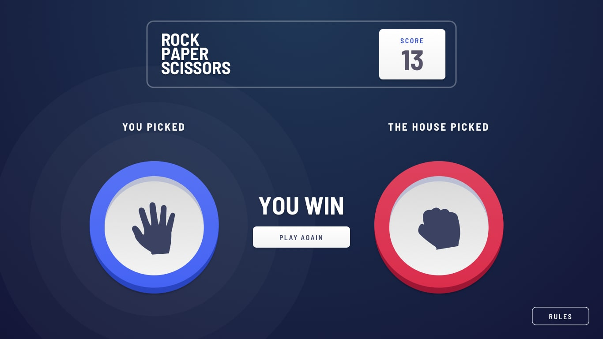

# Rock-Paper-Scissors game

## What's this?

This is a solution to a [Frontend Mentor](https://frontendmentor.io/) challenge.

It´s simple rock paper scissors game. Project was created without using figma or sketch version, so the design is purely based on pictures. It was fun to solve CSS problems.

The layout is fully responsive.

## Tools used
- [React](https://reactjs.org)
- [Styled components](https://styled-components.com/) 
- [Visual Studio Code](https://code.visualstudio.com/)

- ### Desktop view 💻
  
  
- ### Mobile view 📱
  

